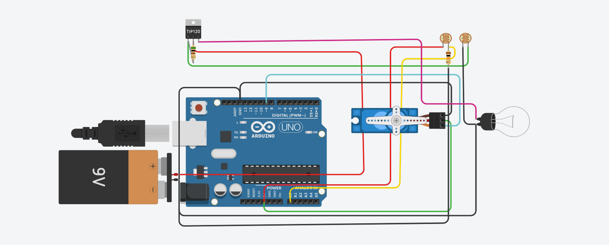

# 🚗 IoT Enabled Smart Light Solution for Electric Vehicle

---

## 📌 Overview
The **IoT Enabled Smart Adaptive Headlight System** is an intelligent vehicle lighting solution designed to improve **nighttime driving safety**.  
The system automatically adjusts the **headlight beam angle and brightness** in real time based on incoming light conditions, reducing glare for oncoming drivers while maintaining adequate road visibility.

This solution is particularly suitable for **electric and smart vehicles**, offering a low-cost and automated approach to adaptive lighting.

---

## 📑 Table of Contents
- [Overview](#-overview)
- [Objective](#-objective)
- [Motivation](#-motivation)
- [Problem Statement](#-problem-statement)
- [System Architecture](#-system-architecture)
- [Hardware Components](#-hardware-components)
- [Software Components](#-software-components)
- [Working Principle](#-working-principle)
- [System Flow](#-system-flow)
- [Circuit Diagram & Wiring](#-circuit-diagram--wiring)
- [Implementation Details](#-implementation-details)
- [Advantages](#-advantages)
- [Limitations](#-limitations)
- [Future Enhancements](#-future-enhancements)
- [License](#-license)
- [Conclusion](#-conclusion)

---

## 🎯 Objective
To develop a **smart adaptive headlight system** that:
- Reduces glare caused by oncoming vehicle headlights
- Automatically adjusts beam angle and brightness
- Enhances nighttime driving safety
- Operates without driver intervention

---

## 🚀 Motivation
- High percentage of road accidents occur during nighttime
- Glare from high-beam headlights causes temporary blindness
- Conventional headlights operate at fixed angles and intensities
- Need for **automatic, intelligent lighting systems** in modern vehicles

---

## ❗ Problem Statement
Traditional automotive headlights lack adaptability to changing traffic and lighting conditions.  
Fixed beam angles and constant brightness levels often result in:
- Reduced visibility
- Increased glare to oncoming vehicles
- Delayed driver reaction times

An adaptive solution is required to dynamically respond to real-time road conditions.

---

## 🏗 System Architecture
The system follows a **sensor–controller–actuator** architecture:

- **Sensor:** Detects incoming light intensity  
- **Controller:** Processes sensor data and makes decisions  
- **Actuator:** Adjusts headlight angle and brightness  

This architecture enables continuous real-time operation.

---

## 🔩 Hardware Components

| Component | Function |
|---------|----------|
| LDR (Light Dependent Resistor) | Detects incoming headlight intensity |
| Arduino Uno | Central control and processing unit |
| Servo Motor | Adjusts headlight beam angle |
| LED Headlight Module | Provides illumination |
| TIP120 Transistor | Safely controls high-current loads |
| Power Supply | Provides stable system power |

---

## 💻 Software Components
- **Programming Language:** Embedded C (Arduino)
- **Libraries Used:** Servo.h
- **Control Method:** Threshold-based logic
- **Monitoring:** Serial communication for debugging

---

## 🔁 Working Principle
1. LDR sensor continuously monitors incoming light intensity
2. Arduino reads analog values via ADC
3. Sensor data is compared against a preset threshold
4. If glare is detected:
   - Servo motor tilts the headlight downward
   - Headlight brightness is reduced
5. When glare disappears:
   - Beam angle and brightness return to default state

---

## 🔄 System Flow
Start
  |
  v
Read LDR Value
  |
  v
Is Light Intensity > Threshold?
  |---- Yes ----> Tilt Beam + Reduce Brightness
  |
  |---- No -----> Restore Default Position
  |
  v
Repeat Continuously

---

## 🔌 Circuit Diagram & Wiring
The diagram below illustrates the **complete circuit and wiring connections** of the adaptive headlight system.

Key connections include:
- LDR connected to analog pin A0
- Servo motor connected to PWM pin D9
- LED module controlled via transistor
- Common ground across all components

---

## 🧪 Implementation Details
- All components are integrated within the headlight enclosure
- LDR sensors are positioned to capture oncoming light effectively
- Servo motor is mechanically linked to the reflector or LED mount
- Compact layout ensures protection from dust and moisture
- System operates continuously once powered

---

## ✅ Advantages
- Reduces glare for oncoming traffic
- Improves nighttime road safety
- Fully automatic operation
- Low-cost and energy efficient
- Compatible with electric and smart vehicles

---

## ⚠️ Limitations
- Effectiveness reduces in fog, rain, or snow
- Sensor calibration required over time
- Heat management needed inside compact enclosures
- Best performance when adaptive systems are widely adopted

---

## 🔮 Future Enhancements
- Camera-based glare detection
- AI-based beam control
- Vehicle CAN bus integration
- Automatic sensor calibration
- Multi-axis headlight movement

---

## 📄 License
This project is intended for **academic and educational use**.  
An **MIT License** is recommended for open-source distribution.

---

## 🧾 Conclusion
The **IoT Enabled Smart Adaptive Headlight System** provides an effective and practical solution to glare-related nighttime driving issues.  
By combining real-time sensing, intelligent control, and mechanical actuation, the system demonstrates strong potential for integration into **next-generation vehicle lighting systems**.

